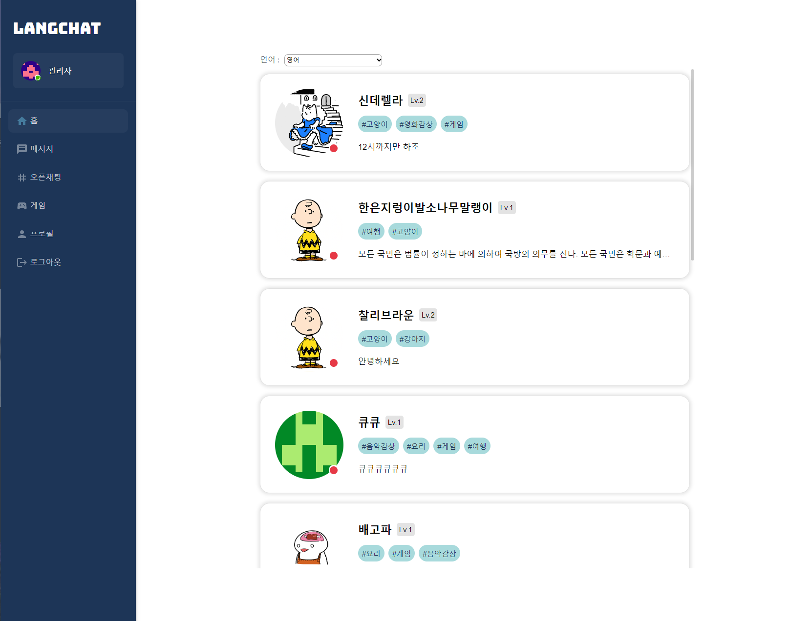
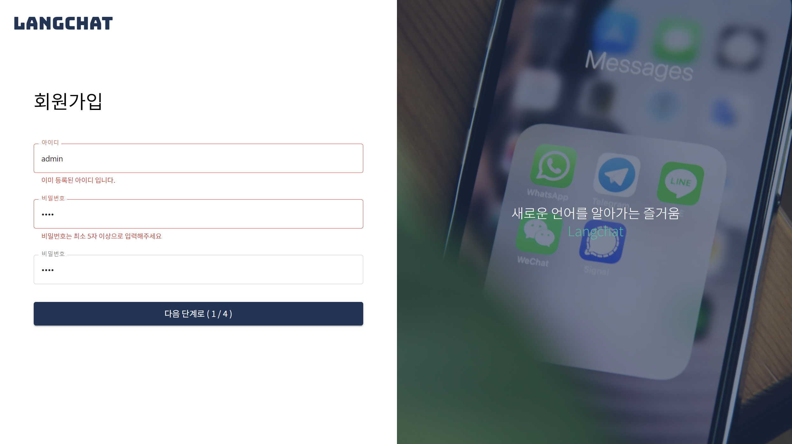
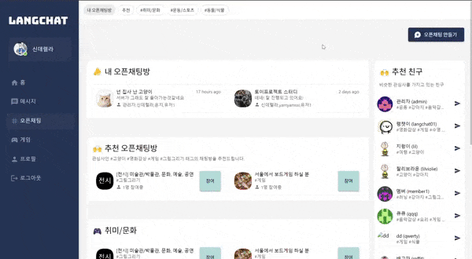
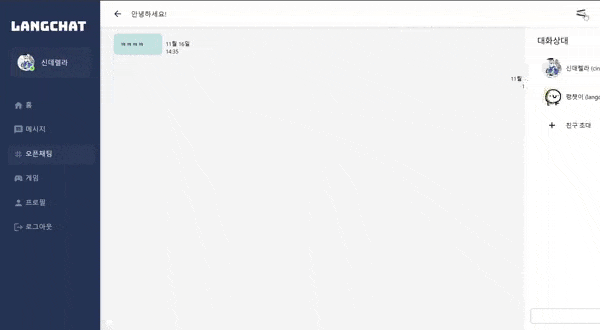
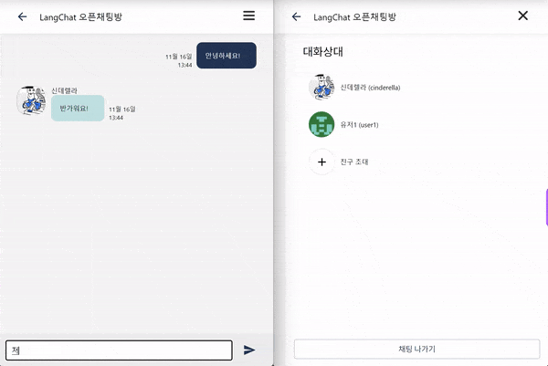
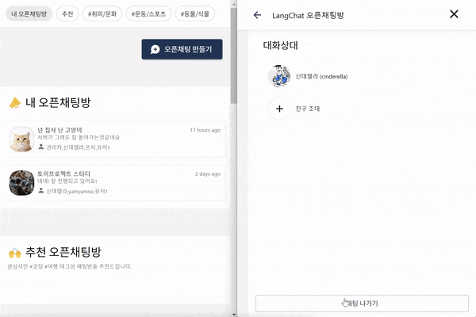

# LANGCHAT: 언어 학습을 위한 채팅 앱

패스트캠퍼스 X 야놀자 프론트엔드 부트캠프 토이프로젝트2 12조

### 프로젝트 소개

제작기간 : 2023.11.06 ~ 2023.11.16
제작인원 : 4명

<!-- 이부분은 추후에 링크 확정되면 수정필요 -->

### 배포 주소

🌐 배포링크 : [https://langchat-464b7.web.app/](https://langchat-464b7.web.app/)

### 팀원 소개

<!-- 가나다순으로 일단 정렬 -->
<!-- 기능 개발하신 부분을 작성해주세요! -->

|                                                 팀장 - 백상원                                                 |                                                팀원 - 김성겸                                                 |                                                 팀원 - 지홍규                                                 |                                                팀원 - 한은지                                                 |
| :-----------------------------------------------------------------------------------------------------------: | :----------------------------------------------------------------------------------------------------------: | :-----------------------------------------------------------------------------------------------------------: | :----------------------------------------------------------------------------------------------------------: |
|  |  |  |  |
|                                [@Yamyam-code](https://github.com/Yamyam-code)                                 |                                    [@skyeome](https://github.com/skyeome)                                    |                                  [@JiHongkyu](https://github.com/JiHongkyu)                                   |                                  [@lilviolie](https://github.com/lilviolie)                                  |
|                        <ul><li>기능개발1</li><li>기능개발2</li><li>기능개발3</li></ul>                        |                 <ul><li>레이아웃</li><li>로그인/회원가입 기능</li><li>오픈채팅기능</li></ul>                 |          <ul><li>초기셋팅</li><li>웹소켓 연결/실시간 채팅 로직 구현</li><li>1대1채팅 기능</li></ul>           |                       <ul><li>기능개발1</li><li>기능개발2</li><li>기능개발3</li></ul>                        |

## 기술 스택 및 라이브러리

### 사용 기술

        


### 협업툴

   

## 🎯 주요 구현 사항

- [x] `useState` 또는 `useReducer`를 활용한 상태 관리 구현
- [x] `Sass`, `styled-component`, `emotion`, `Chakra UI`, `tailwind CSS` 등을 활용한 스타일 구현
- [x] `react` 상태를 통한 CRUD 구현
- [x] 상태에 따라 달라지는 스타일 구현
- [x] `custom hook`을 통한 비동기 처리 구현
- [x] 유저인증 시스템(로그인, 회원가입) 구현
- [x] `jwt`등의 유저 인증 시스템 (로그인, 회원가입 기능)
- [x] 소켓을 이용한 채팅 구현

## 선택 구현 사항

- [ ] `Next.js`를 활용한 서버 사이드 렌더링 구현
- [x] `typescript`를 활용한 앱 구현
- [ ] `storybook`을 활용한 디자인 시스템 구현
- [ ] `jest`를 활용한 단위 테스트 구현

## 😀 팀원별 상세 구현 사항

<!-- 순서는 일단 네비게이션 목록 순서로 정렬 -->
<!-- 은지님 구현 사항 -->
<details>
<summary style="font-size: 1.125rem">한은지 : 첫 화면, 프로필 페이지</summary>
<div markdown="1">

### 주요 구현사항 설명



</div>
</details>

<!-- 홍규님 구현 사항 -->
<details>
<summary style="font-size: 1.125rem">지홍규 : 메시지 페이지</summary>
<div markdown="1">

### 주요 구현사항 설명

**메시지 보내기 보달**

- 모든 유저 리스트 표시
- 자음, 모음으로 유저 이름 검색
- 유저 선택 시 보내기 버튼 활성화
- 메시지 보내면 기존 채팅방 유무 확인 후 채팅방 생성 or 채팅방 이동


**채팅리스트**

- 로그인 유저가 포함된 채팅 리스트 표시
- 상대방의 프로필 사진과 이름 표시
- 해당 채팅방의 마지막 메시지와 경과 시간 표시
- 로딩 시 채팅 리스트 Skeleton UI 적용


**모든 채팅 가져오기**

- 채팅방 클릭 시 해당 채팅방의 대화 내용 모두 가져오기


**1대1채팅**

- 로그인한 유저와 대화상대방의 메시지 레이아웃 구분
- 같은 시간에 보낸 메시지는 마지막 메시지에 한 번만 표시
- 웹 소켓 연결 및 실시간 통신 로직 구현


**로그아웃**

- 로그아웃 시 `localStorage` 값과 `accessTokenState` 값 초기화 후 로그인 페이지로 이동


</div>
</details>

<!-- 유저 인증/오픈채팅 구현 사항 -->
<details>
<summary style="font-size: 1.125rem">김성겸 : 인증관련, 오픈채팅 페이지</summary>
<div markdown="1">

### 유저 인증 / 회원가입

**회원가입**

- 아이디 - 중복 아이디 체크 기능
- 비밀번호 - 5글자 이하인지 유효성 검사
- 프로필 사진을 정사작형으로 잘라주는 에디터 추가
- 관심사 선택
- 언어, 수준 선택



**로그인**

- 로그인시 오류 발생하면 에러 메시지를 toast로 보여주는 기능
- 이미 로그인 되어있으면 로그인 페이지로 갈수 없습니다.


### 오픈 채팅

- 오픈채팅방 생성 기능
- 로딩시 skeleton UI 적용
- 추천친구/대화방 보여주는 기능
- 채팅방 참여, 나가기, 초대 기능

<br />
  
**오픈채팅방 생성**  


**오픈채팅방 초대**  


**실시간 오픈채팅**  


**오픈채팅 나가기**  


</div>
</details>

<!-- 상원님 구현 사항 -->
<details>
<summary style="font-size: 1.125rem">백상원 : 게임 페이지</summary>
<div markdown="1">

### 주요 구현사항 설명

## 랭킹


- 각 유저의 최고 점수를 기반으로 랭킹을 나열합니다.
- 기본적으로 유저의 등수를 보여주며 호버 시 그 유저의 점수를 표기합니다.

## 끝말잇기 게임


- 네이버 API의 사전 검색 및 정규식을 활용하여 단어 유효성 검사
- 남은 시간 게이지바로 표시
- 효과음 사용
</div>
</details>

## ➡️ 유저 흐름(flow) 이미지

<!-- 유저 플로우 생성 -->

## 📂 폴더 구조

```
📦 LangChat
├─ node_modules/
├─ public/
│  ├─ index.html
│  ├─ favicon.ico
│  └─ manifest.json
├─ src/
│  ├─ components
│  │  ├─ common/
│  │  ├─ todo.../
│  │  └─ …/
│  ├─ assets/
│  ├─ common/
│  ├─ pages/
│  ├─ utils/
│  ├─ hooks/
│  ├─ styles/
│  ├─ types/
│  ├─ reducer/
│  ├─ App.js (라우팅까지)
│  └─ index.js
├─ package.json
├─ package-lock.json
└─ README.md
```
