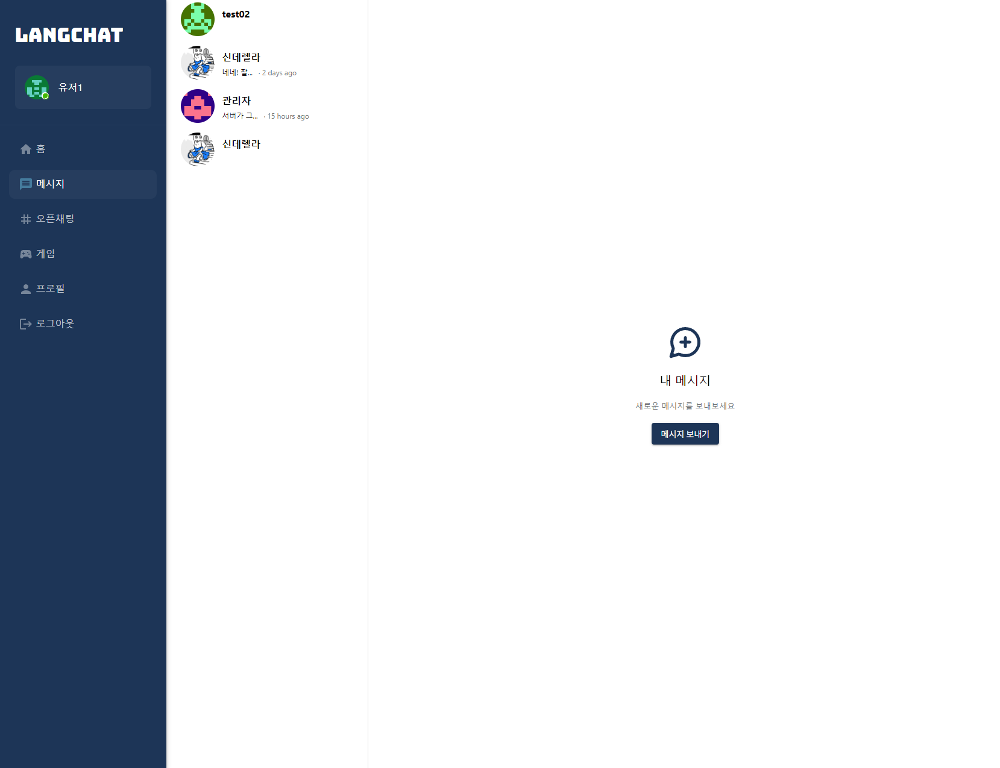

# LANGCHAT: 언어 학습을 위한 채팅 앱

패스트캠퍼스 X 야놀자 프론트엔드 부트캠프 토이프로젝트2 12조

### 프로젝트 소개

제작기간 : 2023.11.06 ~ 2023.11.16
제작인원 : 4명

<!-- 이부분은 추후에 링크 확정되면 수정필요 -->

### 배포 주소

🌐 배포링크 : [https://langchat-464b7.web.app/](https://langchat-464b7.web.app/)

### 팀원 소개

<!-- 가나다순으로 일단 정렬 -->
<!-- 기능 개발하신 부분을 작성해주세요! -->

|                                                 팀장 - 백상원                                                 |                                                팀원 - 김성겸                                                 |                                                 팀원 - 지홍규                                                 |                                                팀원 - 한은지                                                 |
| :-----------------------------------------------------------------------------------------------------------: | :----------------------------------------------------------------------------------------------------------: | :-----------------------------------------------------------------------------------------------------------: | :----------------------------------------------------------------------------------------------------------: |
|  |  |  |  |
|                                [@Yamyam-code](https://github.com/Yamyam-code)                                 |                                    [@skyeome](https://github.com/skyeome)                                    |                                  [@JiHongkyu](https://github.com/JiHongkyu)                                   |                                  [@lilviolie](https://github.com/lilviolie)                                  |
|                        <ul><li>기능개발1</li><li>기능개발2</li><li>기능개발3</li></ul>                        |                       <ul><li>기능개발1</li><li>기능개발2</li><li>기능개발3</li></ul>                        |                        <ul><li>기능개발1</li><li>기능개발2</li><li>기능개발3</li></ul>                        |                       <ul><li>기능개발1</li><li>기능개발2</li><li>기능개발3</li></ul>                        |

## 기술 스택 및 라이브러리

### 사용 기술

        


### 협업툴

   

## 🎯 주요 구현 사항

- [x] `useState` 또는 `useReducer`를 활용한 상태 관리 구현
- [x] `Sass`, `styled-component`, `emotion`, `Chakra UI`, `tailwind CSS` 등을 활용한 스타일 구현
- [x] `react` 상태를 통한 CRUD 구현
- [x] 상태에 따라 달라지는 스타일 구현
- [x] `custom hook`을 통한 비동기 처리 구현
- [x] 유저인증 시스템(로그인, 회원가입) 구현
- [x] `jwt`등의 유저 인증 시스템 (로그인, 회원가입 기능)
- [x] 소켓을 이용한 채팅 구현

## 선택 구현 사항

- [ ] `Next.js`를 활용한 서버 사이드 렌더링 구현
- [x] `typescript`를 활용한 앱 구현
- [ ] `storybook`을 활용한 디자인 시스템 구현
- [ ] `jest`를 활용한 단위 테스트 구현

## 😀 팀원별 상세 구현 사항

<!-- 순서는 일단 네비게이션 목록 순서로 정렬 -->
<!-- 은지님 구현 사항 -->
<details>
<summary style="font-size: 1.125rem">한은지 : 첫 화면, 프로필 페이지</summary>
<div markdown="1">

### 주요 구현사항 설명


</div>
</details>

<!-- 홍규님 구현 사항 -->
<details>
<summary style="font-size: 1.125rem">지홍규 : 메시지 페이지</summary>
<div markdown="1">

### 주요 구현사항 설명



</div>
</details>

<!-- 유저 인증/오픈채팅 구현 사항 -->
<details>
<summary style="font-size: 1.125rem">김성겸 : 인증관련, 오픈채팅 페이지</summary>
<div markdown="1">

### 주요 구현사항 설명


</div>
</details>

<!-- 상원님 구현 사항 -->
<details>
<summary style="font-size: 1.125rem">백상원 : 게임 페이지</summary>
<div markdown="1">

### 주요 구현사항 설명

## 랭킹


- 각 유저의 최고 점수를 기반으로 랭킹을 나열합니다.
- 기본적으로 유저의 등수를 보여주며 호버 시 그 유저의 점수를 표기합니다.

## 끝말잇기 게임


- 네이버 API의 사전 검색 및 정규식을 활용하여 단어 유효성 검사
- 남은 시간 게이지바로 표시
- 효과음 사용
</div>
</details>

## ➡️ 유저 흐름(flow) 이미지

<!-- 유저 플로우 생성 -->

## 📂 폴더 구조

```
📦 LangChat
├─ node_modules/
├─ public/
│  ├─ index.html
│  ├─ favicon.ico
│  └─ manifest.json
├─ src/
│  ├─ components
│  │  ├─ common/
│  │  ├─ todo.../
│  │  └─ …/
│  ├─ assets/
│  ├─ common/
│  ├─ pages/
│  ├─ utils/
│  ├─ hooks/
│  ├─ styles/
│  ├─ types/
│  ├─ reducer/
│  ├─ App.js (라우팅까지)
│  └─ index.js
├─ package.json
├─ package-lock.json
└─ README.md
```
